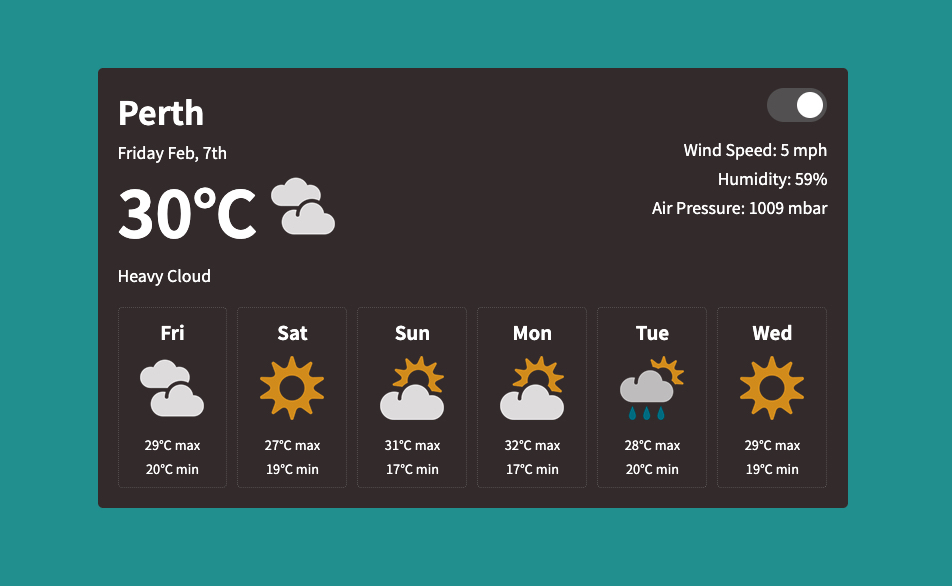
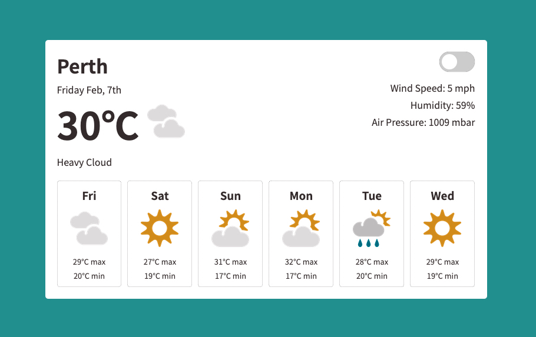

# A Weather App written in ReactJs

#### Watch it in action at https://amudsweather.netlify.app/

## Dark Mode

## Light Mode

## Features
- Shows today's weather & the weather for the whole week
- Integrates with OpenWeather (https://openweathermap.org/) to get the weather 
- Melbourne's Latitude & Longitude values have been hardcoded, but you can easily make it work for any location
- Toggle Switch between Dark & Light Mode

## Technology
- Designed to be Responsive for mobile & tablets
- ReactJs with Redux for State management
- Axios Javascript library for HTTP API requests to OpenWeather
- CSS3 for styling
- Jest & Enzyme for Snapshot Testing
